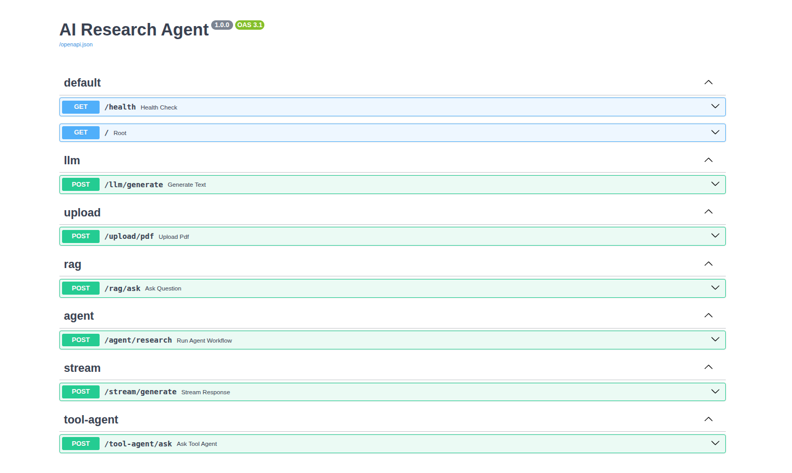

# 🧠 AI Research Agent Platform

An autonomous **multi-agent AI research system** for intelligent information discovery, retrieval, reasoning, and report generation using **LLMs, Agentic RAG, and workflow orchestration**.

Inspired by systems like **Perplexity AI**, **OpenAI Deep Research**, **Glean**, and **You.com**.

---

## 🚀 Overview

AI Research Agent Platform is a production-oriented **GenAI backend system** that enables users to perform deep research using **multi-agent collaboration** and **retrieval-augmented generation (RAG)**.

The system is designed to:

* Understand complex research queries
* Plan research workflows autonomously
* Retrieve contextual information
* Search external and internal knowledge sources
* Generate grounded, citation-aware responses
* Produce structured research outputs

---

## 🎯 Why This Project?

Modern AI systems require more than simple chat interfaces. This project explores how production-grade research assistants are built using Retrieval-Augmented Generation (RAG), multi-agent orchestration, dynamic tool calling, semantic search, and streaming responses.

The goal is to demonstrate practical GenAI engineering patterns used in intelligent research systems, knowledge assistants, and autonomous AI workflows.

---

## ⭐ Key Highlights

* Multi-agent orchestration using LangGraph
* Agentic RAG with semantic retrieval
* Dynamic tool calling
* Hybrid knowledge retrieval (documents + web search)
* Streaming AI responses (SSE)
* PostgreSQL, Redis and Qdrant integration
* Dockerized deployment
* FastAPI-based async architecture

---

## ✨ Core Capabilities

### Multi-Agent Research System

The platform uses specialized AI agents working together to execute research tasks.

Potential agent roles include:

* **Planner Agent** → Breaks complex queries into subtasks
* **Search Agent** → Collects information from external sources
* **Retrieval Agent** → Retrieves relevant context from vector databases
* **Summarizer Agent** → Synthesizes information
* **Citation Agent** → Grounds responses with evidence
* **Critic/Validator Agent** → Verifies response quality *(planned)*

---

### Agentic RAG Pipeline

The system follows an **Agentic Retrieval-Augmented Generation workflow** to produce grounded and context-aware responses.

```text
User Query
     ↓
Research Planning
     ↓
Knowledge Retrieval
     ↓
Context Augmentation
     ↓
LLM Reasoning
     ↓
Citation Generation
     ↓
Final Research Response
```

---

## 🏗️ System Architecture

```text
User
 ↓
FastAPI API Layer
 ↓
Tool Agent
 ↓
LangGraph Workflow
 ├── Planner Agent
 ├── Research Agent
 └── Summarizer Agent
 ↓
Tool Layer
 ├── Vector Retrieval
 └── Web Search
 ↓
Qdrant / External Sources
 ↓
LLM
```

---

## ⚙️ Features

> This section evolves as the project grows.

### Research & Reasoning

* [x] Multi-agent orchestration
* [x] Agentic RAG
* [x] Context-aware retrieval
* [x] Multi-step reasoning
* [ ] Deep research mode

### Document Intelligence

* [x] Document ingestion
* [x] Semantic chunking
* [x] Embedding generation
* [x] Vector retrieval
* [x] Project-scoped document tracking
* [ ] Multi-modal document understanding

### Search & Retrieval

* [x] Semantic search
* [x] Dynamic tool calling
* [x] Web search integration
* [x] Full webpage scraping
* [ ] Hybrid retrieval
* [ ] Re-ranking

### Response Generation

* [x] Citation-aware generation
* [x] Streaming responses (SSE)
* [x] Persistent conversation memory
* [x] Structured report generation
* [x] Saving and retrieving reports

### Infrastructure

* [x] FastAPI backend
* [x] Dockerized deployment
* [x] Docker Compose setup
* [x] PostgreSQL
* [x] Redis
* [x] Qdrant
* [x] Environment configuration
* [x] LangGraph workflow orchestration
* [x] Alembic database migrations
* [ ] Monitoring & observability

### Evaluation

* [ ] Hallucination detection
* [ ] Retrieval evaluation
* [ ] Faithfulness scoring
* [ ] Latency benchmarking

---

## 🧩 Tech Stack

### Backend

* Python
* FastAPI
* AsyncIO
* Pydantic

### AI / GenAI

* LangGraph
* OpenAI SDK / Gemini
* Agentic RAG

### Databases

* PostgreSQL
* Qdrant
* Redis

### Infrastructure

* Docker
* Docker Compose

### Frontend

* React (Vite)
* Tailwind-inspired CSS (Vanilla CSS & CSS Variables)
* Lucide React Icons
* Marked (Markdown rendering)

---

## 🔌 API Endpoints

### Health Check

```http
GET /health
```

### Upload Documents

```http
POST /upload
```

### RAG Query

```http
POST /rag/ask
```

### Tool Agent Query

```http
POST /tool-agent/ask
```

### Streaming Generation

```http
POST /stream/generate
```

---

## ⚡ Quick Start

```bash
git clone <your-repository>

cd ai_research_agent

cp .env.example .env

docker compose up --build
```

Open:

```text
http://localhost:8000/docs
```

---

## 📂 Project Structure

```bash
app/
├── api/              # API routes
├── agents/           # Agent logic
├── rag/              # RAG pipeline
├── db/               # Database layer
├── core/             # Configurations
├── prompts/          # Prompt templates
├── services/         # Business logic
├── workers/          # Background jobs
├── tests/            # Test suite
└── main.py
```

---

## 🔄 Research Workflow

Example Query:

> "Research the impact of AI agents in healthcare"

The system may:

1. Plan research subtasks
2. Search knowledge sources
3. Retrieve relevant context
4. Perform reasoning over retrieved information
5. Generate grounded answers
6. Provide evidence-backed citations

---

## 💻 Local Development

### Clone Repository

```bash
git clone http://github.com/Sam-Verma/ai_research_agent.git

cd ai-research-agent-platform
```

### Create Virtual Environment

```bash
python -m venv venv
```

#### Linux / macOS

```bash
source venv/bin/activate
```

#### Windows

```bash
venv\Scripts\activate
```

### Install Dependencies

```bash
pip install -r requirements.txt
```

### Configure Environment Variables

Create a `.env` file:

```env
OPENAI_API_KEY=
GEMINI_API_KEY=

POSTGRES_URL=
REDIS_URL=

QDRANT_URL=
QDRANT_API_KEY=
```

### Run Server

```bash
uvicorn app.main:app --reload
```

---

## 🛣️ Roadmap

### Research Intelligence

* Advanced planning workflows
* Deep research capabilities
* Memory-enabled conversations

### Retrieval Improvements

* Hybrid retrieval
* Re-ranking
* Knowledge graph integration

### User Experience

* Streaming responses
* Research dashboard
* Interactive reports

### Production Readiness

* Background jobs
* Evaluation framework
* Monitoring & tracing
* CI/CD pipeline

---

## 📸 Demo

## Swagger UI



### Document Upload Workflow

(Add screenshot)

### RAG Query Example

(Add screenshot)

### Tool Calling Example

(Add screenshot)

### Architecture Diagram

System design diagram coming soon.

### Demo Video

A walkthrough demo and research workflow preview will be added after core implementation.

---

## 🎯 Learning Goals

This project explores:

* Multi-agent orchestration
* Agentic workflows
* RAG systems
* LLM tool calling
* Vector search
* Async backend engineering
* AI system design
* Production-grade GenAI architecture

---

## 🤝 Contributing

Contributions, issues, and feature requests are welcome.


## ⭐ Support

If you found this project helpful, consider giving it a **star ⭐**.
